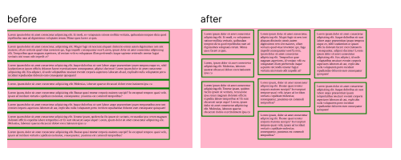

## waterfall-flexbox-layout

### JavaScript- function which is used to create a waterfall layout of the block with text-elements using flexbox.

**createWaterfall.js — the wanted function**

The root block can look like this:

```
<div class="root">
  <div class="el">And element block</div>
  <div class="el">has its own style</div>
  <div class="el">and it should  be free to chose any height</div>
  <div class="el">but the width will be changed</div>

</div>
```

The function only changes the width of the elements and margin-top.

```
 /**
  * 
  * @param {HTMLDivElement} rootNode: the block which is the parent to all of the elements in waterfall
  * @param {number} columnCount: the number of columns
  * @param {number} elementGap: gaps in px between all elements from the different sides
  */

    function createWaterfall(rootNode, columnCount, elementGap) {
    // ...
    }
```

The repository has an index.html file just as an example.

